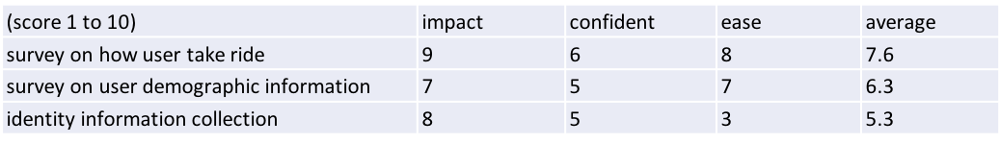

# Google analytics certificate capstone project  

## Bike Share Growth Hacking Data Analysis
I extended the project to reflect the whole life cycle of the data driven growth hacking process[1]:

Starts with primary goal for the capstone project: **Analyze**

## Background
You are a junior data analyst working in the marketing analyst team at Cyclistic, a bike-share company in Chicago. The director of
marketing believes the company’s future success depends on maximizing the number of annual memberships (**the North Star metric**)[1]. Therefore, your
team wants to understand how casual riders and annual members use Cyclistic bikes differently. From these insights, your team
will design a new marketing strategy to convert casual riders into annual members. But first, Cyclistic executives must approve
your recommendations, so they must be backed up with compelling data insights and professional data visualizations. (see [project instruction](https://github.com/arcadianlyric/google_data_analytics/blob/main/capstone_project/bike_share/Case-Study-1_Bike-share.pdf) for more details)  

Three questions will guide the future marketing program:
1. **How do annual members and casual riders use Cyclistic bikes differently?**   
2. Why would casual riders buy Cyclistic annual memberships?  
3. How can Cyclistic use digital media to influence casual riders to become members?  

## Goals
You will produce a report to answer the first question, with the following deliverables:
1. A clear statement of the business task  
2. A description of all data sources used  
3. Documentation of any cleaning or manipulation of data  
4. A summary of your analysis  
5. Supporting visualizations and key findings  
6. Your top three recommendations based on your analysis  

Data analysis steps

## Ask
1. A clear statement of the business task \
Study the behavior differences between members and casual riders using historical data, identify features and patterns that can help convert casual riders to members and guide digital media ads delivery.  

## Prepare
2. A description of all data sources used \
Data downloaded from a [public source](https://divvy-tripdata.s3.amazonaws.com/index.html). I used data dated from 042020 to 032021 to reflect the most recent trends. Although the incident of COVID-19 has dramatically changed people's travel behavior, it is still useful to investigate data of the past 12 months rather than data from a normal year like 2019, because the post-pandemic influence will last for a long time and could permanently alter the travel habit. They are historical data with information on: 'ride_id', 'rideable_type', 'started_at', 'ended_at', 'start_station_name', 'start_station_id', 'end_station_name', 'end_station_id', 'start_lat', 'start_lng', 'end_lat', 'end_lng', 'member_casual', 'time_length'.  

## Process
3. Documentation of any cleaning or manipulation of data \
Followed the standard data cleaning process (details see bike_share_report.ipynb): \
Removed (or impute) missing values \
Checked outliers, data bias    
Created new metrics (riding time length, distance, time types of the day etc.) to investigate rider behaviors.    

## Analyze
4. A summary of your analysis \
Scripts in bike_share_report.ipynb, following PEP8 coding standards. \
Grouped ride cases by member/ casual to compare difference on time and spacial levels: \
Stratification on time: hour of day, day of week, week of year \
Stratification on spacial geo location: most commonly used stations \
Stratification on bike type  
Riding time, distance, speed  

## Share
5. Supporting visualizations and key findings \
key findings on **user features**:  
1/ Station usage by member and casual rides vary. Stations popular among casual rides include many recreative places, such as Streeter Dr & Grand Ave (close to the Navy pier), Millennium Park, Shedd Aquarium etc.  

2/ Casual rides take longer time, lower speed (statistically significant), fits the profile that casual riders wondering around the city for recreation.  

3/ On weekend there are more casual rides and less member rides. Most rides start on Noon and Evening for both groups. It seems most members do not primarily ride to commute, which will show a pattern of dual peaks on morning and evening, which is consistent with the description that "users are more likely to ride for leisure". More likely for lunch/ dinner and shopping, or for places with limited parking. Less rides on winter, when cold weather prohibits outdoor activities.         

Details for analysis in [Jupyter notebook](https://github.com/arcadianlyric/google_data_analytics/blob/main/capstone_project/bike_share/src/bike_share_analysis.ipynb)  

## Act
6. Your top three recommendations based on your analysis  
The time spacial profile of casual riders shows that they are likely for recreative purpose, possible tourists. If most are from other sates, they are unlikely to be converted to annual members. More data on member behavior are needed to make reliable recommendations.  Yet, as members ride on weekends and not for commuting, it is possible to convert more casual users by introducing they ways of daily use of the bike.
1/  Design survey to further stratify and investigate members behavior (how they ride on weekday/weekend, demographic information, etc.) to learn user habits, behavior and features.     
2/  Consider to launch campaign/ads (in summer) to show casual riders possible ways to use bike for daily activities, such as lunch, shopping, etc.     
3/  Study previous data to find out features of riders most likely to be converted to members and design ads to target such population.  

# Growth Hacking  
## Ideate
Although the goal is to convert casual riders to members, this is a mix of conversion and retention issue, as we want to keep users to continue using bikes yearly, not just single rides. After primary analysis, we generated some ideas and find out that we need more information from users to answer additional questions. 

Additional data are needed to answer others questions  
2. Why would casual riders buy Cyclistic annual memberships?   
Prepare: Data integration, need additional credit card or other identity (user-id, if there is an app for purchase and ride management) information to identify purchase made by same users and investigate transfer rate from casual to member.  
Act: Design survey to learn the reasons for casual riders to convert to member.  
3. How can Cyclistic use digital media to influence casual riders to become members? 
Act: Design survey to learn where did users heard Cyclistic on digital media (ads on social media website, personal blogs, travel agency etc.) to profile target users with features (stations visit, website visit, visit channel iOS/Android etc.) linked to higher conversion/retention.  
Act: Consider to deliver digital media ads to the target population. Some A/B test will help to evaluate potential ads performance. A/B test design and report see [AB_test](capstone_project/bike_share/ab_test.pdf).  

## Prioritize
Based on the ICE (impact, confidence, ease) method[1], we weill prioritize survey.

Scenario:  
we have a mobile app for users to make payment, unlock bike by QR scan etc. So we could track user-id.   
[Survey](capstone_project/bike_share/survey_design.pdf)

## Test
**A/B Tets**
Scenario:  
Based on our survey, we have identified that casual riders learned Cyclistic from www.wheretogochicago.com are more likely to be converted to members.   
One marketing goal is to use digital media on conversion/retention, now we have designed new ads and want to test it's performance on this website by following some standard practice[2].
A/B test design and report see [AB_test](capstone_project/bike_share/ab_test.pdf). 
Simulated pageview and clicks data from a [previous A/B test project](https://github.com/arcadianlyric/udacity_ab_test).

## References
1. [Hacking Growth: How Today's Fastest-Growing Companies Drive Breakout Success by Morgan Brown, Sean Ellis](https://books.google.com/books/about/Hacking_Growth.html?id=LcS_DAAAQBAJ)
2. [A/B Testing: The Most Powerful Way to Turn Clicks Into Customers by Dan Siroker, Pete Koomen](https://books.google.com/books/about/A_B_Testing.html?id=VfVvAAAAQBAJ)

## Appendix
Details for analysis in [Jupyter notebook](https://github.com/arcadianlyric/google_data_analytics/blob/main/capstone_project/bike_share/src/bike_share_analysis.ipynb) 

