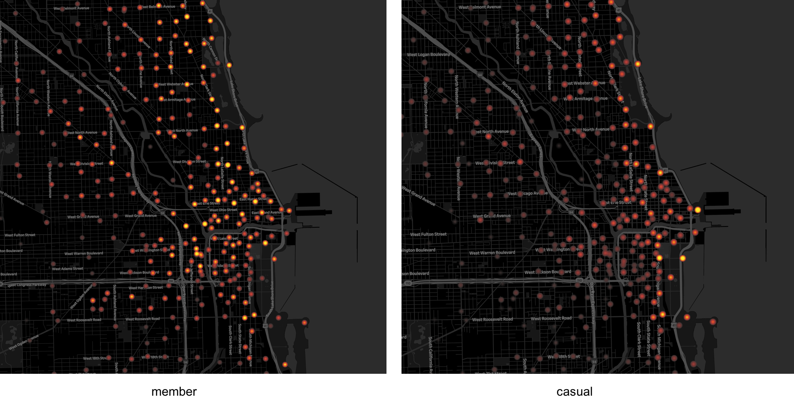
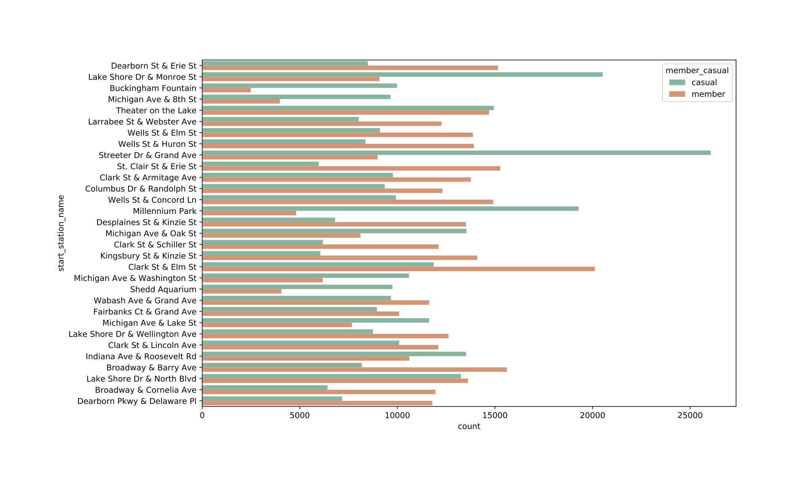
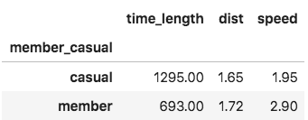
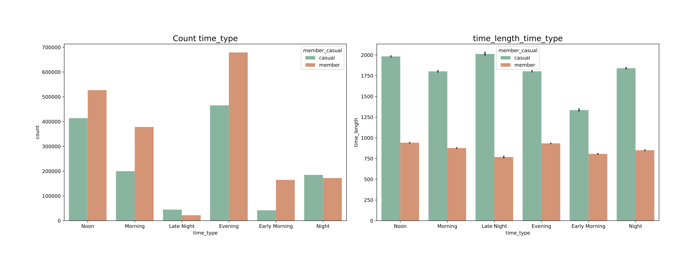
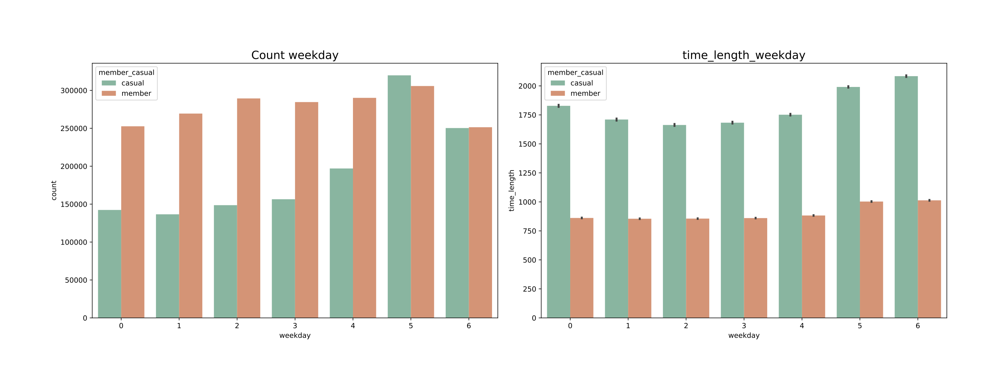
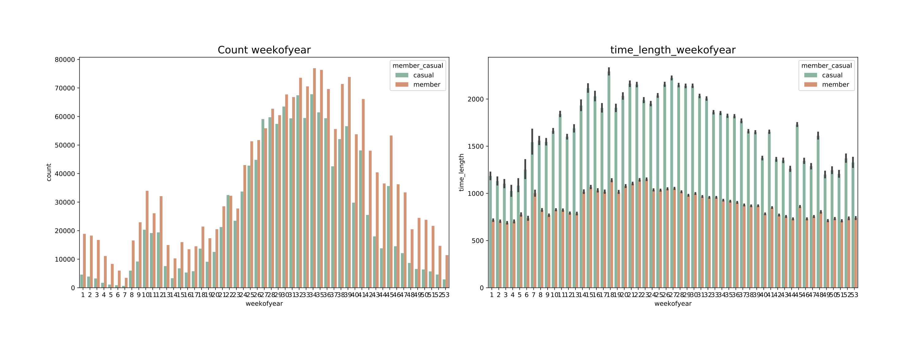

## Google analytics certificate capstone project  

### Bike Share
#### Background
You are a junior data analyst working in the marketing analyst team at Cyclistic, a bike-share company in Chicago. The director of
marketing believes the company’s future success depends on maximizing the number of annual memberships. Therefore, your
team wants to understand how casual riders and annual members use Cyclistic bikes differently. From these insights, your team
will design a new marketing strategy to convert casual riders into annual members. But first, Cyclistic executives must approve
your recommendations, so they must be backed up with compelling data insights and professional data visualizations. (see pdf file for more details)  

Three questions will guide the future marketing program:
1. **How do annual members and casual riders use Cyclistic bikes differently?**   
2. Why would casual riders buy Cyclistic annual memberships?  
3. How can Cyclistic use digital media to influence casual riders to become members?  

#### Goals
You will produce a report to answer the first question, with the following deliverables:
1. A clear statement of the business task  
2. A description of all data sources used  
3. Documentation of any cleaning or manipulation of data  
4. A summary of your analysis  
5. Supporting visualizations and key findings  
6. Your top three recommendations based on your analysis  

#### Ask
1. A clear statement of the business task \
Study the behavior difference between members and casual riders using historical data, identify trends and patterns that can help convert casual riders to members and guide digital media ads deliver.  

#### Prepare
2. A description of all data sources used \
Data downloaded from a [public source](https://divvy-tripdata.s3.amazonaws.com/index.html). I used data dated from 042020 to 032021 to reflect the most recent trends. Although the incident of COVID-19 has dramatically changed people's travel behavior, it is still useful to investigate data of the past 12 months rather than data from a normal year like 2019, because the post-pandemic influence will last for a long time and could permanently alter the travel habit. They are historical data with information on: 'ride_id', 'rideable_type', 'started_at', 'ended_at', 'start_station_name', 'start_station_id', 'end_station_name', 'end_station_id', 'start_lat', 'start_lng', 'end_lat', 'end_lng', 'member_casual', 'time_length'.  

#### Process
3. Documentation of any cleaning or manipulation of data \
Followed the standard data cleaning process (details see bike_share_report.ipynb): \
Removed (or impute) missing values \
Checked outliers, data bias    
Created new metrics (riding time length, distance, time types of the day etc.) to investigate rider behaviors.    

#### Analyze
4. A summary of your analysis \
Scripts in bike_share_report.ipynb, following PEP8 coding standards. \
Grouped ride cases by member/ casual to compare difference on time and spacial levels: \
Time: hour of day, day of week, week of year \
Spacial: most commonly used stations \
Riding time, distance, speed  

#### Share
5. Supporting visualizations and key findings \
key findings:  
1/ Station usage by member and casual rides vary. Stations popular among casual rides include many recreative places, such as Streeter Dr & Grand Ave (close to the Navy pier), Millennium Park, Shedd Aquarium etc.  

2/ Casual rides take longer time, lower speed, seemingly wondering around the city.  

3/ On weekend there are more casual rides and less member rides. Most rides start on Noon and Evening for both groups. It seems members do not primarily ride to commute, which will show pattern of dual peaks on morning and evening. More likely for lunch/ dinner and shopping, and for places with limited parking. Less rides on winter, when cold weahter prohibit outdoor activities.         

#### Act
6. Your top three recommendations based on your analysis  
The time spacial profile of casual riders shows that they are likely for recreative purpose, possible tourists. If most are from other sates, they are unlikely to be converted to annual members. More data on member behavior are needed to make reliable recommendations.  Yet, as members ride on weekends and not for commuting, it is possible to convert more casual users by introducing they ways of daily use of the bike.
1/  Furhter investigate how members use bikes for weekday/daily activities (design survey etc.) to learn their habits.     
2/  Consider to launch campaign/ads (in summer) to show casual riders possible ways to use bike for daily activities, such as lunch, shopping, etc.     
3/  Study previous conversion data to make predictions. Investigate whether there are enough bikes at the popular stations during peaks hours; If people find no bike when needed, poor user experience will hurt conversion.  

#### Next
Additional data needed to answer others questions  
2. Why would casual riders buy Cyclistic annual memberships?   
Need credit card or other identity information to identify purchase made by same users and investigate conversion rate from casual to member.  
3. How can Cyclistic use digital media to influence casual riders to become members?  
Consider to deliver digital media ads near stations where most users converted from casual to member. Some A/B test will help to evaluate potential ads performance. A/B test design see **ab_test.pdf**.  

#### Appendix
Details for analysis in Jupyter notebook, bike_share_report.ipynb  

